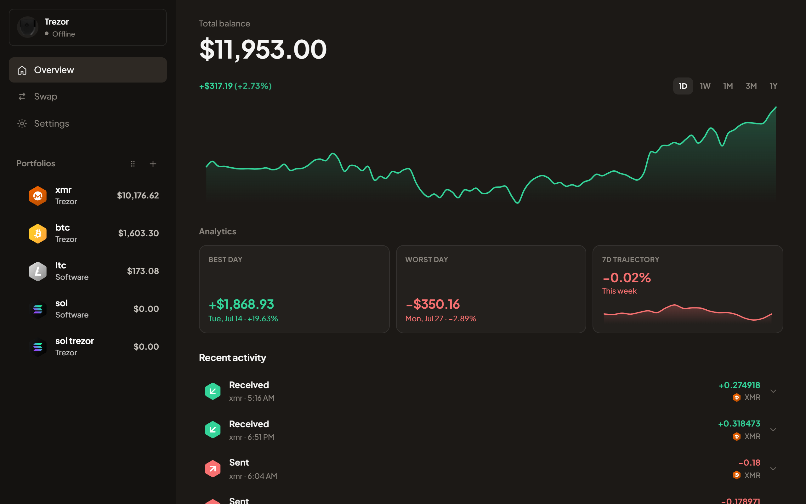
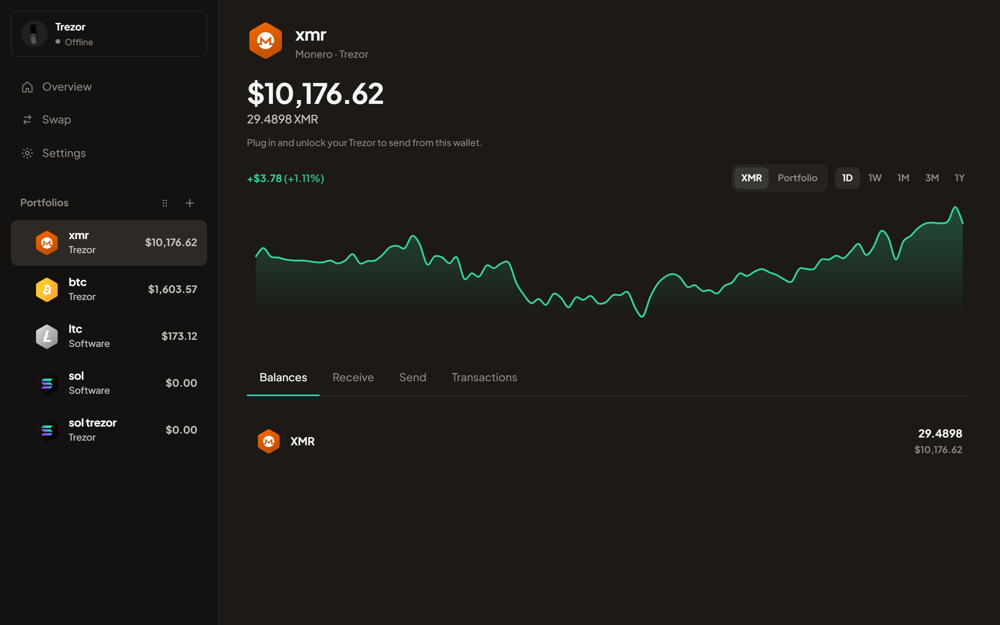

# Opal

Hybrid self-custody for Windows.

Opal is a **hybrid wallet**: software portfolios, Trezor hardware, and watch-only addresses in one sidebar. Software keys stay in an encrypted local vault; Trezor keys never leave the device.

## What it does

- **Vault** - Argon2id + AES-256-GCM envelope encryption, optional wipe after 10 failed unlocks
- **Software wallets** - BIP39 create/restore (12/24), optional passphrase, gap discovery
- **Trezor** - connect, sync funded accounts, verify receive addresses, send when the device is unlocked
- **Watch-only** - track addresses (XMR needs a view key)
- **Chains** - BTC, ETH + major L2s, SOL, LTC, DOGE, XMR, TRX, and a small token allowlist
- **Send / receive** - fee presets, send max, RBF on supported UTXO chains, QR receive, address-poisoning checks
- **Overview** - live balances, growth chart, analytics tiles you can rearrange in Settings
- **Swaps** - Jupiter on Solana; FixedFloat elsewhere (optional API keys in Settings)
- **Tax CSV** - export recent transfers from Settings → Backup
- **Desktop** - tray, single instance, optional start with Windows, Tor SOCKS if you want it

Vault file: `%AppData%\Opal\vault.opal`

## Screenshots

Overview - total balance, growth chart, analytics, and recent activity:



Monero portfolio - XMR balance and 1D performance on Trezor:



## Quick start (dev)

You need Node 20+, Rust stable (`rustup`), and Visual Studio Build Tools with the C++ workload.

```bash
npm install
npm run tauri:dev
```

Useful scripts:

| Command | Purpose |
|---------|---------|
| `npm run tauri:dev` | Run the desktop app |
| `npm run tauri:build` | Release installer |
| `npm run test:rust` | Rust unit tests |
| `npm run test:balances` | Fiat price resolution smoke test |

More detail: [docs/developing.md](docs/developing.md)

## Project layout

```
src/                 React UI
src-tauri/           Rust core (vault, chains, Trezor, network)
docs/                Product and engineering docs
scripts/             Dev helpers (cargo/tauri wrappers, tests)
public/              Static assets
.github/             Issue templates and release workflow
```

Architecture notes: [docs/architecture.md](docs/architecture.md)

## Releases

Windows installers (and auto-update metadata) publish to the public [`opal-releases`](https://github.com/lilathy/opal-releases) repo. How to cut a release: [docs/releasing.md](docs/releasing.md)

## Security

Report vulnerabilities privately - see [SECURITY.md](SECURITY.md).  
Threat model: [docs/threat-model.md](docs/threat-model.md)

Never commit vault files, seed phrases, private keys, FixedFloat credentials, or updater signing keys. Local secret files are gitignored (`*.local.json`, `.env`, `*.key`).

## License

MIT - see [LICENSE](LICENSE).

Not affiliated with SatoshiLabs / Trezor. Trezor is a trademark of SatoshiLabs.
